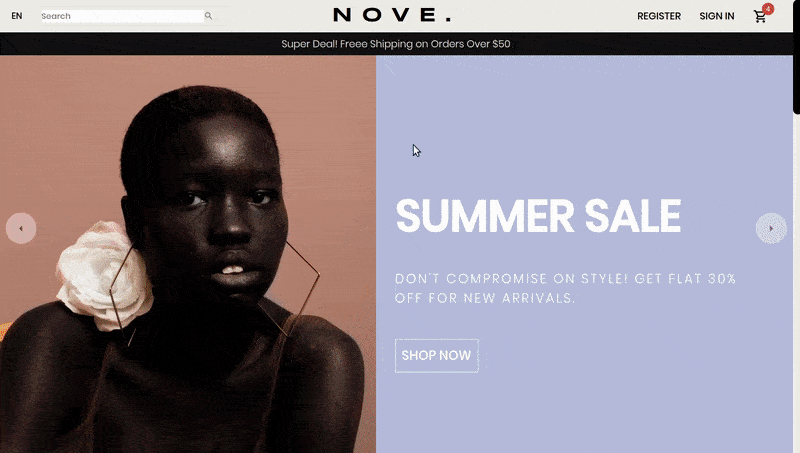

### The following projects were built between 2018 & 2021, during and after [CIMDATA](https://www.cimdata.de/weiterbildung/webentwicklung/) & [DCI](https://digitalcareerinstitute.org/) full stack development course.

 

- [Click here](./src/backendLessons.md) to see all the lessons related to backend ✋

- [Click here](https://github.com/nadiamariduena/react) to see all the tools I used to style the projects

 
 

---

 

# <u>FEATURED PROJECTS</u> ⬇️

 

 

## NEMU (e-boutique)

#### _10/2021_

 

#### Software | languages | libraries used:

React, Commercejs, Stripe, scss, FramerMotion, AOS, MATERIAL UI, Styled Components, Photoshop.

<!-- | Software | languages | libraries used: |
| :------: | :-------: | :-------------: |
|  col 1   |   col2    |      col 1      | -->

 

#### Please [click here](https://github.com/nadiamariduena/e-commerce-react-stripe) or on the image <u>**to visit the app repository 👈** </u>

 

<!--  -->

 

### The Custom version

##### The Project CODE ( upon request): [click here:| NEMU mobiles](https://github.com/nadiamariduena/custom-ecommerce-shop-react-stripe-clean)

 

### About:

 

> **The main motivator for this project was my curiosity** as well as my desire to expand my knowledge. Due to the disastrous effect **the pandemic had on the small businesses** I used to visit, I decided I wanted to find a way to create websites and e-commerce stores that any business owner could use to represent their wares online, be it small or big.  
> Although it isn't fully functional yet, as there is a final error I have to correct to publish it on the web, this is the result of my work.
> **Aside from that I wasn't entirely satisfied with the design so I customized it** as you can see from the preview shown above.

 

##### Detail NEMU (custom)

 

 
 
 

# NOVE

#### _10/2021_ (e-commerce / in progress 👈)

 

#### Software | languages | libraries used:

Mongo, Express, React, Node (**MERN**), STRIPE | FramerMotion, AOS, MATERIAL UI, Styled Components, Photoshop.

<!-- | Software | languages | libraries used: |
| :------: | :-------: | :-------------: |
|  col 1   |   col2    |      col 1      | -->

 

#### Please [click here](https://github.com/nadiamariduena/react-mern-21-backend) or on the image <u>**to visit the app repository** </u>

 

