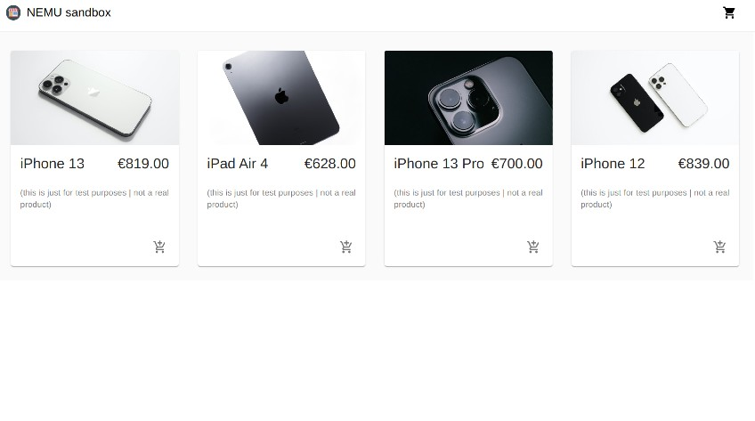

### The following projects were built between 2018 & 2021, during and after [CIMDATA](https://www.cimdata.de/weiterbildung/webentwicklung/) & [DCI](https://digitalcareerinstitute.org/) full stack development course.

##### [**Click here** to see all the projects](https://github.com/nadiamariduena/react)

 
 

# <u>FEATURED PROJECTS</u> ⬇️

 

 
 
 

## NEMU (e-boutique)

#### _10/2021_

#### Software | languages | libraries used:

React, Commercejs, Stripe, scss, FramerMotion, AOS, MATERIAL UI, Styled Components, Photoshop.

<!-- | Software | languages | libraries used: |
| :------: | :-------: | :-------------: |
|  col 1   |   col2    |      col 1      | -->

##### Please click on the image <u>**to view** </u>the app !!

 

<!--  -->

 

### The Custom version

##### The Project CODE ( upon request): [click here:| NEMU mobiles](https://github.com/nadiamariduena/custom-ecommerce-shop-react-stripe-clean)

 

### About:

> **I started this project out of curiosity**, I wanted to see the **advantages & disadvantages** in building an e-commerce app using React, **Commercejs and stripe** and an app build with (Mongodb, Express, React and Nodejs | **MERN**).     **PROS:** Its certainly faster to build, in more of that **commercejs** has some nice tools to communicate with the client. **CONS:** as a beginner I like to have the code in front of me to see from where an issue is coming

 
 

## The Default version

 

> - The Default version only contains the **necessary** in terms of **styles**, the important here was the **functionality**.

 

##### The Default CODE: [ click here:| Default Layout: ](https://github.com/nadiamariduena/e-commerce-react-stripe)

 

# INDEX

 

- **Commercejs** is fetched inside the **App.js**
  **STRIPE** is fetched inside the **PaymentForm.jsx**

 

- **Token** is initialized inside the **Checkout.jsx**
- **AddressForm.jsx** You will find everything necessary to the shipping form, this data will be used inside the **PaymentForm.jsx**

 
 
 

- **Products.jsx** contains the grid that contains all the items inside the card ( text below )

 

- **Product.jsx** contains the ca**rd**, inside of the Cards you will find the img, the title, the product name, the product price, the product description and the add to cart button, all of the data is coming from the **commercejs** API

 

- **Inside of the Banners** that are within the product folder, you will find the videos for the top and the bottom.

> The styles are either styled components or material **MUI**

 
 
 

 
